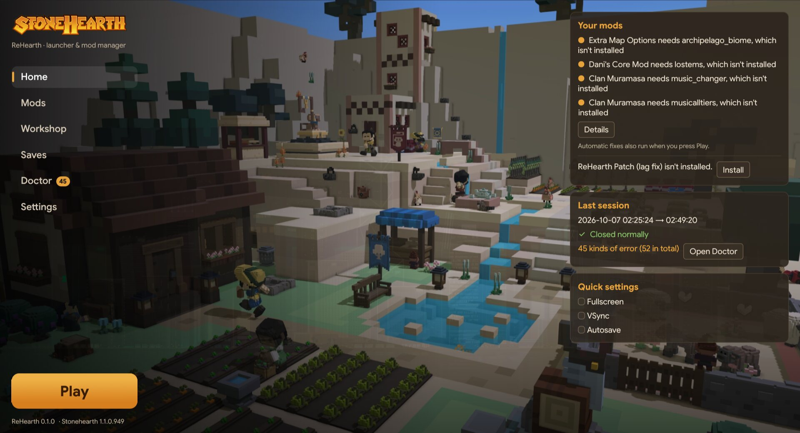
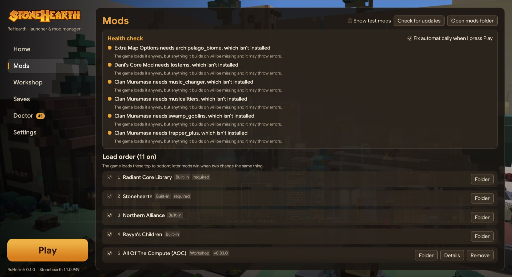
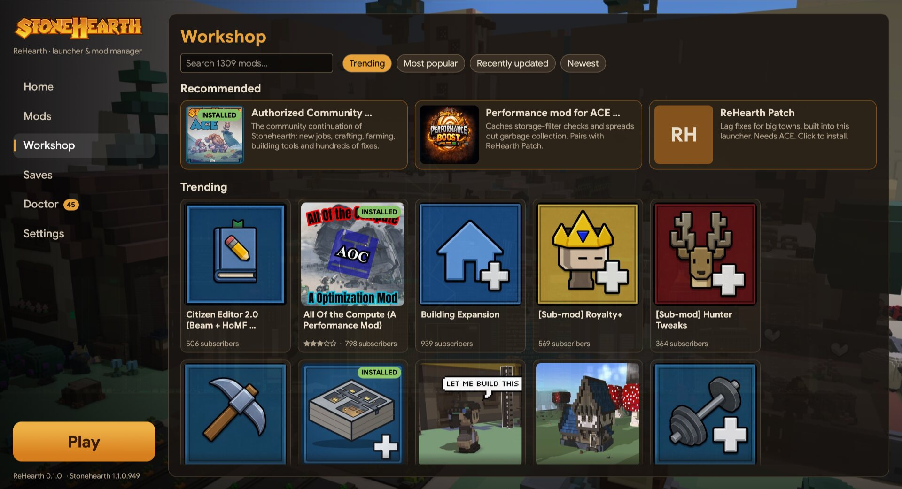
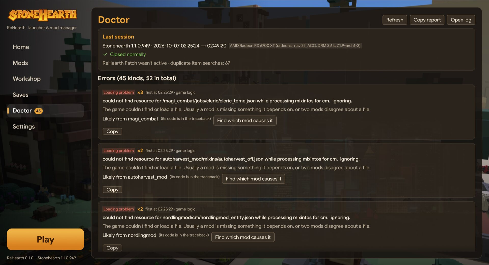

<p align="center">
  
</p>

<h1 align="center">ReHearth</h1>

<p align="center">
  A launcher and mod manager for Stonehearth on Linux.<br>
  It fixes mod load order, tells you which mod broke your game, and installs Workshop mods without leaving the app.
</p>

<p align="center">
  <a href="https://github.com/Aphrodine-wq/rehearth/releases/latest"></a>
  <a href="https://github.com/Aphrodine-wq/rehearth/actions/workflows/ci.yml"></a>
  
  <a href="LICENSE"></a>
</p>

<p align="center">
  <a href="#install">Install</a> ·
  <a href="#what-it-does">What it does</a> ·
  <a href="#faq">FAQ</a> ·
  <a href="#building-from-source">Build</a>
</p>



> ReHearth is a fan project. It is not affiliated with or endorsed by Radiant Entertainment or Riot Games.
> You need your own copy of Stonehearth on Steam.

## Why

Stonehearth's last official update was 1.1.0.949, in 2018. The community kept it going: the
[ACE](https://steamcommunity.com/sharedfiles/filedetails/?id=1577375188) project continues the game, and
the Workshop has well over a thousand mods. Running a big mod list is still hard, though:

- Mods with no dependency between them load in no guaranteed order, so two mods that change the same
  file can swap winners from one launch to the next.
- A mod whose dependency is missing or switched off still loads, and fails quietly later.
- When something breaks, the clue is one line somewhere in a long `stonehearth.log`.
- Big towns get slow.

ReHearth sits in front of the game and deals with these. It reads the same manifests and settings the
game does, shows you what it found, and fixes what it safely can before you press PLAY.

## Install

ReHearth runs on 64-bit Linux with glibc 2.35 or newer: Ubuntu 22.04, Debian 12, Fedora 36, SteamOS
and anything newer. You need Steam (native or Flatpak) and Stonehearth installed.

### Option 1: AppImage (no install)

1. Download **[ReHearth-x86_64.AppImage](https://github.com/Aphrodine-wq/rehearth/releases/latest/download/ReHearth-x86_64.AppImage)**.
2. Make it runnable: right-click → Properties → "Allow executing as program", or
   `chmod +x ReHearth-x86_64.AppImage`.
3. Double-click it.

To get a menu entry, open **Settings** in ReHearth and press **Add ReHearth to the app menu**.

### Option 2: one-line install

```sh
curl -fsSL https://raw.githubusercontent.com/Aphrodine-wq/rehearth/main/install.sh | sh
```

This puts `rehearth` in `~/.local/bin` and adds ReHearth to your app menu. Nothing needs root. To remove
it, run the same line with `sh -s -- --uninstall` at the end. Your mods, saves and game settings stay.

### Steam Deck

Switch to Desktop Mode and use the AppImage (option 1). Running ReHearth from Game Mode hasn't been
tested yet.

### Updating

ReHearth checks GitHub for a new version when it starts. When there is one, an **Update** button appears
at the bottom of the menu; it downloads the new version in place and asks you to restart. You can turn
the check off in **Settings**, or update from a terminal with `rehearth --update`.

### First run

1. Run Stonehearth once on its own first, so it has a settings file.
2. Open ReHearth. It finds Stonehearth in any of your Steam libraries. If it doesn't, set the game
   folder in **Settings**.
3. The Home screen lists mod problems. Press **Fix all**, or just press **PLAY**; fixes run then too.
4. For the lag fixes, subscribe to ACE (the **Workshop** screen has it under Recommended), then install
   **ReHearth Patch** from Home.

The game always starts through Steam, so it keeps your Proton version and launch options.

## What it does

| | |
|---|---|
|  |  |
| **Mods.** A health check with one-click fixes, the files two mods both replace (you pick which copy wins), and every mod in the order the game will load it. | **Workshop.** Browse and search the whole Stonehearth Workshop, and install or remove mods through your running Steam client. |
|  | |
| **Doctor.** Reads the game's log after every session, groups the errors, names the mod behind each one and explains it in plain words. | |

- **Install all needed mods.** When your mods depend on mods you don't have, one button looks them all
  up on the Workshop and lists what it found, and one more installs them. Manifests only name a mod's
  internal name, so the match is made by title; after each download ReHearth checks the mod really is
  the one that was needed, and removes it again if it isn't. Anything it can't find gets a Search button.
- **Automatic fixes.** When you press PLAY, ReHearth switches on mods your other mods need, keeps the
  newest copy of a mod that's installed twice, switches off mods that can't be read, and pins every
  contested file to the copy you chose. It never deletes your files.
- **Find the problem mod.** Pick an error and ReHearth halves the list of suspect mods with each test
  session until one is left. It does this with launch arguments only, so your mod settings never change.
- **Safe mode.** Play one session with only the base game.
- **Live log.** While the game runs, Doctor shows the log as it's written. You can turn on detailed
  logging for a single mod.
- **Saves.** Back up all saves to a `.tar.gz` and restore them. Your current saves are backed up before
  a restore.
- **Graphics settings.** Fullscreen, VSync, shadows, SSAO and draw distance, written to the game's own
  settings file. ReHearth keeps a copy of the original.

### The ReHearth patch mod

ReHearth comes with a small game mod, **ReHearth Patch**, built on top of ACE. It's early: version 0.1.0
has one fix so far.

- **Item searches no longer run twice.** When a hearthling looks for an item "anywhere", the game
  searches the ground and storage at the same time, and both searches kept going after one found
  something. That doubled the pathfinding work for every find, and it gets worse as a town grows. Now the
  first search to find something cancels the other.

Doctor shows whether the patch loaded in your last session, and how many duplicate searches the log
recorded. More fixes will follow as they're found and measured; see the [roadmap](#roadmap).

## How mod loading works

From the official modding guide and the engine itself: base mods load first, and every other mod loads
after the mods in its manifest `dependencies`. A missing or switched-off dependency is silently ignored,
mods in a dependency loop are switched off for the session, and when two mods override the same file the
later one wins. Mods with no dependency between them have no guaranteed order.

ReHearth fixes that last part by writing a generated mod, **ReHearth Load Order**
(`mods/rehearth_load_order`). It depends on every mod in a file conflict and overrides each contested file
with the chosen copy, pointing straight at that mod's file, so nothing is copied. The pick defaults to the
most recently updated mod, and you can change it per file on the Mods screen. Deleting the folder undoes
it.

Debug-only mods like Debug Tools are left alone: other mods list them as load-order hints, not as real
dependencies.

## FAQ

**ReHearth says Stonehearth wasn't found.**
Set the folder by hand in **Settings**. It's the folder that contains `Stonehearth.exe`, usually
`~/.local/share/Steam/steamapps/common/Stonehearth`.

**Workshop installs don't start.**
Steam must be running and signed in, because ReHearth installs through it. A download that makes no
progress for two minutes is cancelled with a message.

**Does it change my game files?**
Only what you'd change in the game's own mod screen: `user_settings.json` (backed up first). It also adds
its own folders to `mods/` (the load-order mod and the patch). It only ever deletes folders it created
itself, which carry a `.rehearth-managed` marker.

**Does it work with Flatpak Steam?**
It finds and starts the game through Flatpak Steam. Workshop installs through Flatpak Steam haven't been
tested.

**Windows or Mac?**
No. ReHearth is built for Linux, where Stonehearth runs through Proton.

**Something went wrong. How do I report it?**
[Open an issue](https://github.com/Aphrodine-wq/rehearth/issues) and include the output of
`rehearth --report`. If it's about a game error, press **Copy report** in Doctor and paste that too.

## Roadmap

- A repeatable big-town benchmark, so lag fixes come with numbers. The pieces are in `mods/rehearth_bench`
  and `tools/bench.sh`, but hearthlings in the test world don't haul yet, so it doesn't load the
  simulation.
- More patch fixes, each measured with that benchmark.
- Tuning the game's Lua garbage collector (`lua.gc_step_pause`, `lua.gc_step_mul`) for large towns.

## Command line

| Flag | Effect |
|---|---|
| `--report` | print what ReHearth sees: game folder, version, mods in load order, problems |
| `--fix` | apply the automatic mod fixes without opening a window |
| `--find-needed` | look up the missing mods your mods need, and show what would be installed |
| `--update` | update ReHearth to the latest release |
| `--browse [search]` | list Workshop mods as text |
| `--tab <name>` | open on a screen: `home`, `mods`, `workshop`, `saves`, `doctor` or `settings` |
| `--version` | print the version |

## Where things are

| What | Where |
|---|---|
| Mods | `mods/` in the Stonehearth folder (`steamapps/common/Stonehearth`) |
| Workshop mods | `steamapps/workshop/content/253250/` in the same Steam library |
| Game log | `stonehearth.log` in the Stonehearth folder |
| Game settings | `user_settings.json` in the Stonehearth folder (backup: `user_settings.json.rehearth-bak`) |
| Load-order mod | `mods/rehearth_load_order/` (generated; delete it to undo) |
| ReHearth settings | `~/.config/rehearth/config.json` |
| Cached title art | `~/.cache/rehearth/art/` |

## Building from source

You need Rust 1.95 or newer ([rustup](https://rustup.rs)). There are no other dependencies: the fonts,
icon and patch mod are built into the binary.

```sh
git clone https://github.com/Aphrodine-wq/rehearth
cd rehearth
cargo install --path launcher
```

Run the tests with `cargo test` in `launcher/`. A copy built from source never replaces itself; it only
tells you when a release is out.

To publish a release, bump `version` in `launcher/Cargo.toml`, commit, and push a matching tag
(`git tag v0.2.0 && git push --tags`). GitHub Actions builds it on Ubuntu 22.04 and uploads the AppImage,
the tarball and the plain binary.

### Project layout

| Path | Contents |
|---|---|
| `launcher/` | the ReHearth app (Rust, egui) |
| `launcher/src/tabs/` | one file per screen |
| `launcher/src/loadorder.rs` | the load-order engine and automatic fixes |
| `launcher/src/doctor.rs`, `bisect.rs` | log reading, blame, and find the problem mod |
| `launcher/src/workshop.rs`, `steam.rs` | Workshop browsing, and installs through the Steam client |
| `launcher/src/needed.rs` | finding mods that other mods need on the Workshop |
| `launcher/src/update.rs` | self-update and the app menu entry |
| `mods/rehearth_patch/` | the patch mod (built into the launcher) |
| `mods/rehearth_bench/`, `tools/bench.sh` | the big-town benchmark (unfinished) |
| `packaging/` | icon, desktop entry |
| `install.sh` | the one-line installer |

### Notes for modders

Things learned while building this:

- Never run `steamcmd +login anonymous` against a real Steam library. It shares the library, treats
  owned games as unlicensed, and deletes their files. ReHearth installs Workshop mods through the Steam
  client's own `libsteam_api.so` instead.
- Mods symlinked into `mods/` are invisible to the game under Proton. Copy them.
- `--game.main_mod=<mod>` with `skip_title` hangs on a black screen in 1.1 (microworld too):
  `radiant:new_game` only fires after the title screen asks for a new game.
- `radiant.exit()` is ignored outside autotests.
- `radiant.util.get_config` finds the calling mod from the stack, so calling it through a tail call
  fails; use `get_global_config('mods.<ns>.<key>')`.
- Some base `.smod` files (Northern Alliance, Rayya's Children) contain several `manifest.json` files;
  read the shallowest one.

## Credits

- [Stonehearth ACE](https://github.com/StonehearthACE-team/stonehearth_ace) by the Stonehearth ACE Team.
  Parts of the patch mod are derived from it under the MIT license
  ([LICENSE.ace.md](mods/rehearth_patch/LICENSE.ace.md)).
- Google Sans and Google Sans Code, under the SIL Open Font License
  ([OFL.txt](launcher/assets/fonts/OFL.txt)).
- Built with [egui](https://github.com/emilk/egui), wgpu, serde, ureq, image and libloading.

Release downloads include these license files in `licenses/`.

## License

Copyright © 2026 James Walton. ReHearth is released under the [MIT License](LICENSE).
